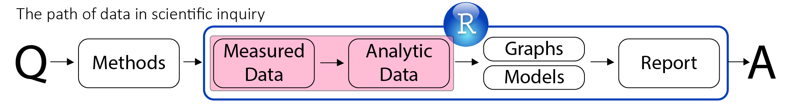
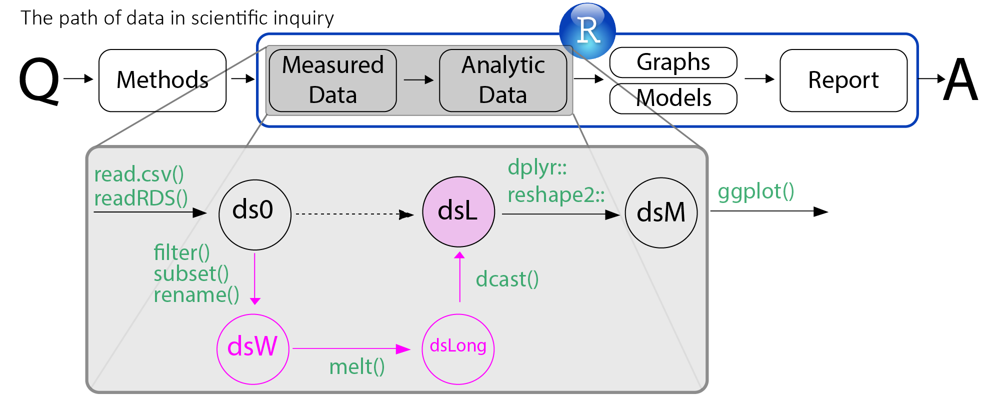

<!--  Set the working directory to the repository's base directory; this assumes the report is nested inside of only one directory.-->
```{r, echo=F, message=F} 
library(knitr)
opts_knit$set(root.dir='../')  #Don't combine this call with any other chunk -especially one that uses file paths.
```

<!-- Set the report-wide options, and point to the external script file. -->
```{r, echo=F, message=T}
require(knitr)
opts_chunk$set(
  results='show', 
  message = TRUE,
  comment = NA, 
  tidy = FALSE,
#   fig.height = 4.8, 
#   fig.width = 6.5, 
  out.width = NULL,
  fig.path = 'figure_rmd_try/',     
  dev = "png",
  dpi = 400
)
echoChunks <- FALSE
warningChunks<- FALSE
messageChunks<- FALSE
outwidthChunks <- "90%"
options(width=120) #So the output is 50% wider than the default.
read_chunk("./Reports/2014-11-04-Producing-Graphs.R") # the file to which knitr calls for the chunks
```


## Overview of the Series

- Oct 14  -- Intro to Reproducible Research  
- Oct 21  -- RR Basic Skills (1): Data Manipulation
- Oct 28  -- Intro to Latent Class and Latent Transition Models  
- Nov 4  -- **RR Basic Skills (2): Graph Production**  
- Nov 11      
- Nov 18  -- RR Basic Skills (3): Statistical Modeling   
- Nov 25  -- RR Basic Skills (4): Dynamic Reporting   
- Dec 2 -- Migrating into R from other Statistical Software   


## Previously:
  
</img>  

### Tidy data

1. Each variable forms a column
2. Each observation forms a row
3. Each type of observational unit forms a table

See [Hadley Wickham's](http://had.co.nz/) paper on [tidy data](http://www.jstatsoft.org/v59/i10/paper)

  

## Previously:

</img> 
```p
"./Scripts/Data/dsL.R"
```

download the files to work along at [GitHub](https://github.com/IALSA/COAG-colloquium-2014F)


## Previously: 

```
"./Scripts/Data/dsL.R"
```
imported the raw data files
```
myExtract <- "./Data/Extract/NLSY97_Attend_20141021/NLSY97_Attend_20141021"
pathSourceData <- paste0(myExtract,".csv") 
SourceData <- read.csv(pathSourceData,header=TRUE, skip=0,sep=",")
ds0 <- SourceData
```
cleaned, transformed , and at the end, exported it. 
```
pathdsLrds <- "./Data/Derived/dsL.rds"
saveRDS(object=dsL, file=pathdsLrds, compress="xz")
```
The slides on [data manipulation](./Reports/2014-10-21-Data-Manipulation.html) were in fact annotations over the live script <code>./Scripts/Data/dsL.R</code>  that brings data to the "dsL" stage every time it is sourced. 

## Load Data {.smaller}
```{r LoadData, echo=T, warning=F, message=F, results='hide'}
```
```{r}
str(dsL)
```


## Load Data {.smaller}
```{r LoadData, echo=T, warning=F, message=F, results='hide'}
```
```{r}
str(dsL)
```


## Load Data
```{r}
dplyr::filter(dsL, id==1)
```

## Load Data
```{r}
dplyr::filter(dsL, id==1) %>% select(id, year, attend, attendF, sexF, raceF)
```

## Today's objective 
```{r dsM01, results="hide", echo=F}
```

```{r loadTheme, results="hide", echo=F}
```

```{r graph25, echo=F, warning=F, message=F, out.width="90%"}
```


## Minimalistic start
<div class="columns-2">
```{r}
dplyr::filter(dsL, id==1) %>% 
  dplyr::select(id, year, attend, attendF)
```

</br> </br>
How often did you **attend** a worhsip service during the last year?
```{r, echo=F}
attendLevels<- c(1:8)
attendLabels<-c( "Never",
                 "Once or Twice",
                 "Less than once/month",
                 "About once/month",
                 "About twice/month",
                 "About once/week",
                 "Several times/week",
                 "Everyday")
attendMetrics <- data.frame(attendLevels, attendLabels)
dplyr::arrange(attendMetrics,-attendLevels)
```
</div>
Q: How do we map these data to abstract dimensions? 


## Preparing the canvas {.smaller}
<div class="columns-2">
```{r dsM01, out.width="50%"}
```

```{r, out.width="95%", eval=FALSE}
p <- ggplot2::ggplot(dsM,aes(x=year,y=attend))
p
```
</br> </br> </br> </br> </br> </br> </br> </br> </br> </br>
```
# Error: No layers in plot
```
</div>
<div class="notes">
The data that you want to visualise and a set of aesthetic mappings
describing how variables in the data are mapped to aesthetic attributes
that you can perceive. [Elegant Graphics for Data Analysis](http://http://ggplot2.org/book/)
</div>
Next: add a geom  
Note: Data mapping


## First strokes: points {.smaller}
<div class="columns-2">
```{r dsM01}
```

```{r graph01, out.width="95%", warning=F}
```
</div>
<div class="notes">
Geometric objects, **geoms** for short, represent what you actually see on
the plot: points, lines, polygons, etc. [Elegant Graphics for Data Analysis](http://http://ggplot2.org/book/)
</div>
Note: Geom  
Next: try a different geom 


## First strokes: lines {.smaller}
<div class="columns-2">
```{r dsM01}
```

```{r graph02, out.width="95%", warning=F}
```
</div>
<div class="notes">
See SAPE [ggplot2 Quick Reference](http://sape.inf.usi.ch/quick-reference/ggplot2/geom) for a graphical guide to most geoms. For the ultimate authority, consult the [official documentation](http://docs.ggplot2.org/0.9.2.1/index.html)
</div>
Note: list of geoms  
Next: combine geoms  


## First strokes {.smaller}
<div class="columns-2">
```{r dsM01}
```

```{r graph03, out.width="95%", warning=F}
```
</div>
Next: mapping inside geoms  


## Flexible mapping  {.smaller}
<div class="columns-2">
```{r dsM01}
```

```{r graph04, out.width="95%", warning=F}
```
</div>
<div class="notes">
See SAPE [ggplot2 Quick Reference](http://sape.inf.usi.ch/quick-reference/ggplot2/geom) for a graphical guide to most geoms. For the ultimate authority, consult the [official documentation](http://docs.ggplot2.org/0.9.2.1/index.html)
</div>
Next: custom graphical themes    
  

## Flexibility of styling {.smaller}
```{r loadTheme, out.width="95%", warning=F}
```
<div class="notes">
For more options see [theme vignettes](http://docs.ggplot2.org/dev/vignettes/themes.html)
</div>
</br> 
Next: apply theme  


## Theme vs No Theme {.smaller}
<div class="columns-2">
```{r graph05, out.width="95%", warning=F}
```
Note: more theme options  
Next: scales, setting axis range  
</br> </br> </br> </br> </br> </br> </br>
```{r graph04a, out.width="95%", warning=F}
```
<div class="notes">
For more options see [theme vignettes](http://docs.ggplot2.org/dev/vignettes/themes.html)
</div>


## Customizing scales: X : limits {.smaller}
<div class="columns-2">
```{r graph06, out.width="95%", warning=F}
```

```{r graph05a, out.width="95%", warning=F}
```
</div>
<div class="notes">
The **scales** map values in the data space to values in an aesthetic space,
whether it be colour, or size, or shape. [Elegant Graphics for Data Analysis](http://http://ggplot2.org/book/)
</div>
Note: Scales  
Next: set axis breaks 


## Customizing scales: X : breaks {.smaller}
<div class="columns-2">
```{r graph07, out.width="95%", warning=F}
```

```{r graph06a, out.width="95%", warning=F}
```
Next: breaks customization 


## Customizing scales: X : breaks : manual {.smaller}
<div class="columns-2">
```{r graph08, out.width="95%", warning=F}
```

```{r graph06a, out.width="95%", warning=F}
```
Next: customizing y-axis 


## Customizing scales: Y {.smaller}
<div class="columns-2">
```{r graph07, out.width="95%", warning=F}
```
</div>
Next: with y-axis customized


## Customizing scales: Y {.smaller}
<div class="columns-2">
```{r graph09, out.width="95%", warning=F}
```
</div>
Next: axes titles  


## Customizing scales: Y {.smaller}
<div class="columns-2">
```{r graph09a, out.width="95%", warning=F}
```
</div>
Next: axes titles 


## Axes titles {.smaller}
<div class="columns-2">
```{r graph10, out.width="95%", warning=F}
```
</div>
Next: adding main title


## Main title {.smaller}
<div class="columns-2">
```{r graph11, out.width="95%", warning=F}

```
</div>
<div class="notes">
There are many ways to add elements in ggplot. Below is another example.  See this handy [cheatsheet](http://zevross.com/blog/2014/08/04/beautiful-plotting-in-r-a-ggplot2-cheatsheet-3/) for more options.
```{r graph11a, out.width="70%"}
```
</div>
Next: learning the lingo  
Note: alternatives, [cheatsheet](http://zevross.com/blog/2014/08/04/beautiful-plotting-in-r-a-ggplot2-cheatsheet-3/)


## The anatomy of a ggplot


The names of ggplot elements are visually explained in another great [ggplot quick reference](http://sape.inf.usi.ch/quick-reference/ggplot2) by SAPE research group.

Next: adding units


## Minimalistic + 1 {.smaller}
<div class="columns-2">
```{r graph12, out.width="95%", warning=F}

```


</br>
Next: grouping cases 
</div>


## Map groupings : individuals {.smaller}
<div class="columns-2">
```{r graph13, out.width="95%", warning=F}

```


</br>
Next: adding more cases 
</div>


## Facing the Overplotting Issue  {.smaller}
<div class="columns-2">
```{r graph14, out.width="95%", warning=F}
```

</br>
Next: jittering lines  
Note: press "p" for zoom  
</div>
<div class="notes">
```{r graph14, out.width="100%", echo=F, warning=F, message=F}
```
</div>


## Jittering lines {.smaller}
<div class="columns-2">
```{r graph15, out.width="95%", warning=F}
```

</br>
Next: jittering  points  
Note: press "p" for zoom    
</div>
</br> </br> </br> </br>
<div class="notes">
```{r graph15, out.width="100%", echo=F,warning=F,message=F}
```
</div>


## Jittering points {.smaller}
<div class="columns-2">
```{r graph16, out.width="95%", warning=F}
```

</br>
Next: coloring lines  
Note: press "p" for zoom    
</div>
</br> </br> </br> </br>
<div class="notes">
```{r graph16, out.width="100%", echo=F,warning=F,message=F}
```
</div>


## Coloring lines {.smaller}
<div class="columns-2">
```{r graph17, out.width="95%", warning=F}
```

</br>
Next: coloring points  
Note: press "p" for zoom    
</div>
</br> </br> 
<div class="notes">
```{r graph17, out.width="100%", echo=F,warning=F,message=F}
```
</div>
To use human names for colors, refer to the [R color palette]([colors in R](http://www.stat.columbia.edu/~tzheng/files/Rcolor.pdf). For explore computer palette [colrd.org](http://http://colrd.com/) and [colorbrewer2](http://http://www.colorbrewer2.net/)


## Coloring points {.smaller}
<div class="columns-2">
```{r graph18, out.width="95%", warning=F}
```

</br>
Next: alpha  
Note: press "p" for zoom    
</div>
</br> 
<div class="notes">
```{r graph18, out.width="100%", echo=F,warning=F,message=F}
```
</div>
For shape and linetypes consult [R cookbook](http://www.cookbook-r.com/Graphs/Shapes_and_line_types/) or [SAPE Quick Reference](http://sape.inf.usi.ch/quick-reference/ggplot2/shape)


## Transparancy / Alpha channel {.smaller}
<div class="columns-2">
```{r graph19, out.width="95%", warning=F}
```

</br>
Next: tuning  1  
Note: press "p" for zoom    
</div>
</br> 
<div class="notes">
```{r graph19, out.width="100%", echo=F,warning=F,message=F}
```
</div>


## Fainter, larger dots {.smaller}
<div class="columns-2">
```{r graph20, out.width="95%", warning=F}
```

</br>
Next: tuning  2  
Note: press "p" for zoom    
</div>
</br> 
<div class="notes">
```{r graph20, out.width="100%", echo=F,warning=F,message=F}
```
</div>


## Crisper, smaller dots {.smaller}
<div class="columns-2">
```{r graph21, out.width="95%", warning=F}
```

</br>
Next: faceting 1  
Note: press "p" for zoom    
</div>
</br> 
<div class="notes">
```{r graph21, out.width="100%", echo=F,warning=F,message=F}
```
</div>


## Faceting {.smaller}
<div class="columns-2">
```{r graph22, out.width="95%", warning=F}
```

</br> </br> </br>
Next: removing factor level  
Note: press "p" for zoom    
</div>
<div class="notes">
```{r graph22, out.width="100%", echo=F,warning=F,message=F}
```
</div>


## Exclude levels {.smaller}
<div class="columns-2">
```{r graph23, out.width="95%", warning=F}
```

</br> </br> </br>
Next: tranforming variable    
Note: press "p" for zoom    
</div>
</br> 
<div class="notes">
```{r graph23, out.width="100%", echo=F,warning=F,message=F}
```
</div>


## Centering time {.smaller}
<div class="columns-2">
```{r graph24, out.width="95%", warning=F}
```

</br> </br> </br> 
Next: final styling  
Note: press "p" for zoom  
</div>
<div class="notes">
```{r graph24, out.width="100%", echo=F,warning=F,message=F}
```
</div>


## Final touches {.smaller}
<div class="columns-2">
```{r graph25, out.width="95%", warning=F}
```

.
</br> </br> </br> </br>
Next: final graph  
</div>


 
----
```{r graph25, echo=F, warning=F, message=F, out.width="100%"}
```


## Next time

- Oct 14  -- Intro to Reproducible Research  
- Oct 21  -- RR Basic Skills (1): Data Manipulation
- Oct 28  -- Intro to Latent Class and Latent Transition Models  
- Nov  4  -- RR Basic Skills (2): Graph Production  
- Nov 11      
- Nov 18  -- **RR Basic Skills (3): Statistical Modeling**   
- Nov 25  -- RR Basic Skills (4): Dynamic Reporting   
- Dec 2 -- Migrating into R from other Statistical Software  

[NLSWeb]:https://www.nlsinfo.org/investigator/pages/login.jsp
[NLS]:http://www.bls.gov/nls/


## Question? Comments?

You can forward questions to Ann Greenwood (ann.greenwood@popdata.bc.ca)  or Vincenza Gruppuso (vincenza@uvic.ca) during the live Q&A. They are standing by to take your questions.   
 


