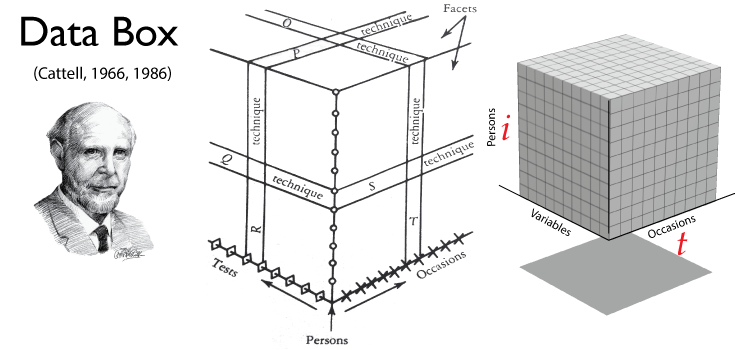
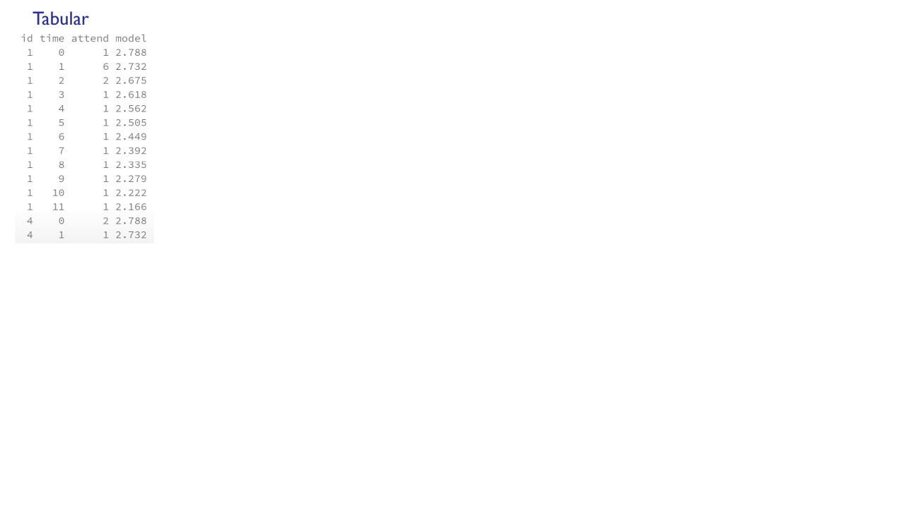
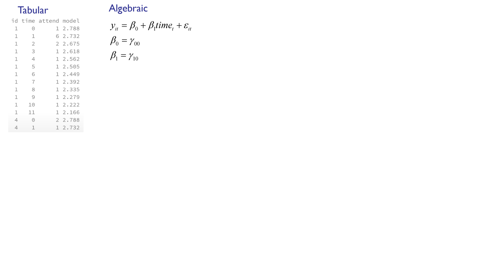
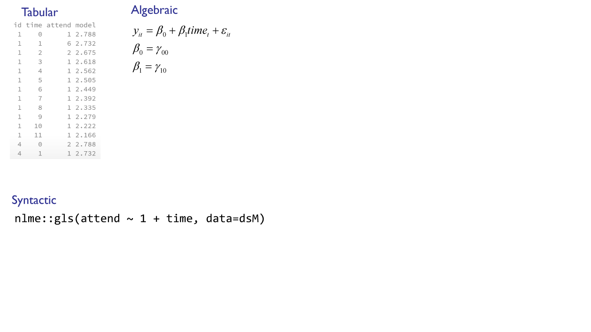
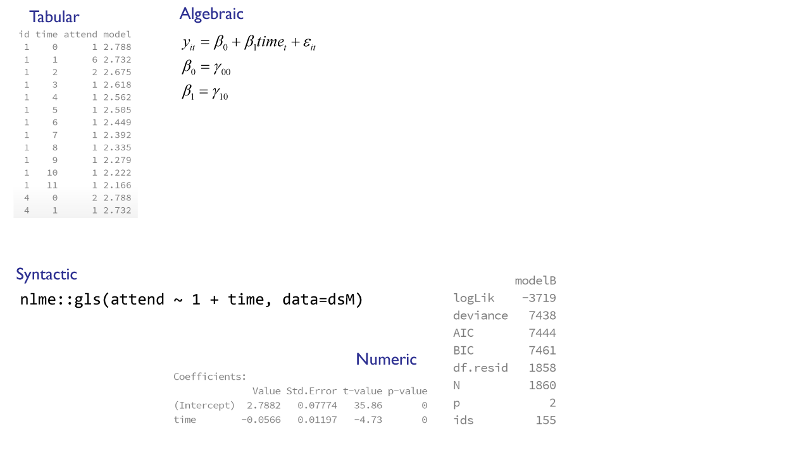
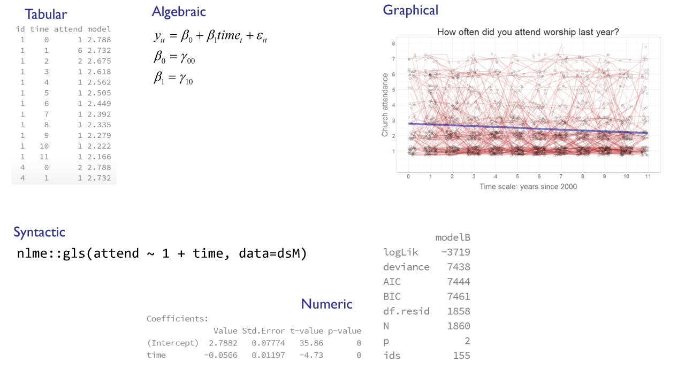
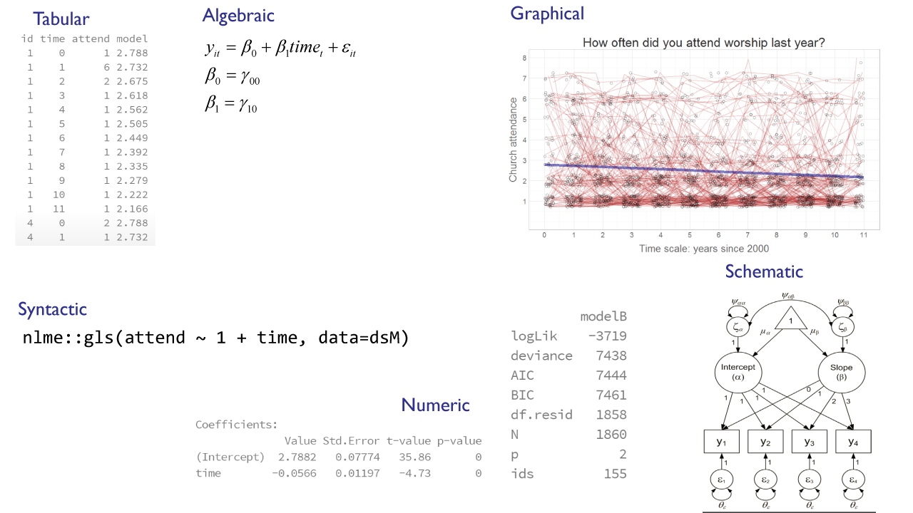

<!--  Set the working directory to the repository's base directory; this assumes the report is nested inside of only one directory.-->
```{r, echo=F, message=F} 
library(knitr)
opts_knit$set(root.dir='../')  #Don't combine this call with any other chunk -especially one that uses file paths.
```

<!-- Set the report-wide options, and point to the external script file. -->
```{r, echo=F, message=T}
require(knitr)
opts_chunk$set(
  results='show', 
  message = TRUE,
  comment = NA, 
  tidy = FALSE,
#   fig.height = 4.8, 
#   fig.width = 6.5, 
  out.width = NULL,
  fig.path = 'figure_rmd/',     
  dev = "png",
  dpi = 70
)
echoChunks <- FALSE
warningChunks<- FALSE
messageChunks<- FALSE
outwidthChunks <- "90%"
options(width=120) #So the output is 50% wider than the default.
read_chunk("./Reports/2014-11-18-Statistical-Modeling.R") # the file to which knitr calls for the chunks
```


## What is Statistical Modeling? {.smaller}
<div class="columns-2">
### What is a model?
 - simplifications of a complex reality   
 - "mechanism" for reproducing data
 - operationalization of substantive theory
 
### What does modeling involve?   
 - generating data points  
 - comparing observed and modeled data
 - describing properties and attribues of a model
 - comparing and contrasting models  

##### (Rodgers, 2010)
</br></br>  

#### Theoretical model of change  
  - Shape  of change
  - Scale  of change
  - Periodicity 

#### Temporal design  
 - Timing  
 - Frequency  
 - Spacing  

### Statistical model of change  
 - Operationalization of theoretical model of change  
 
##### (Collins, 2006) 
 
 
</div>
<div class="notes">
[Rodgers, 2010](http://psych.colorado.edu/~willcutt/pdfs/Rodgers_2010.pdf):  Rodgers, J. L. (2010). The epistemology of mathematical and statistical modeling: a quiet methodological revolution. American Psychologist, 65(1), 1.   
</br>
[Collins, 2006](http://www2.sep.ucr.ac.cr/GESTION/CursoUGES2010/416ec3a16c697369735f64655f6461746f735f6c6f6e6769747564696e616c735f496e74656772616369c3b26e5f64655f6d6f64656c6f735f7465c3b37269636f735f6461746f735f795f6d6f64656c6f735f6573746164c3ad737469636f73.pdf):Collins, L. M. (2006). Analysis of longitudinal data: The integration of theoretical model, temporal design, and statistical model. Annu. Rev. Psychol., 57, 505-528.
</div>
Press (P): Citation   
Next: Example of a modeling project


## Example of data workflow map:

</img> 
```p
"./Scripts/Data/dsL.R"
```

Full example is at [COAG](http://www.coag.uvic.ca/)'s [lecture series](https://ialsa.github.io/COAG-colloquium-2014F) on reproducible research.

<div class="notes">
Last time we talked about the flow of data in a research project. The data flow map shows one possible scenario of data development, relevant to the data at hand. Stage <code>dsW</code>,  <code>dsLong</code>, might be optional, or narrate different transformations. The purpose of such a map is to organize our understanding of the script underlying this map. Thus, when results of the study are reported this map can be used to ease the deconstruction of the script and its further adaptation.
</div>


## Study in Focus

### NLSY97
  - [National Longitudinal Study of Youth 1997](https://nlsinfo.org/cohorts/nlsy97)
  - Household sample
  - ~ 9,000 respondents
  - 5 cohorts
  - ages from 13 to 31
  - started in 1997 
  - continues today
  - <div class="red2">outcome: church attendance</div>


## Load Data {.smaller}
```{r LoadPackages, echo=F, warning=F, message=F, results='hide'}
```

```{r LoadData, echo=T, warning=F, message=F, results='hide'}
```
```{r}
str(dsL)
```

<div class="notes">
first we load the data set that we have annotated in the previous lectures
</div>


```{r loadTheme, out.width="95%", warning=F, echo=F}
```

## Focal outcome {.smaller}
<div class="columns-2">

```{r dsM00}
```
</br> </br>
How often did you **attend** a worhsip service during the last year?
```{r, echo=F}
attendLevels<- c(1:8)
attendLabels<-c( "Never",
                 "Once or Twice",
                 "Less than once/month",
                 "About once/month",
                 "About twice/month",
                 "About once/week",
                 "Several times/week",
                 "Everyday")
attendMetrics <- data.frame(attendLevels, attendLabels)
dplyr::arrange(attendMetrics,-attendLevels)
```
</div>
</br> </br>


## Map data to graphics {.smaller}
<div class="columns-2">
```{r dsM00}
```
</br>
```{r graphBasic, out.width="95%", warning=F, echo=F}
```
</div>
Press (P): Note | Next: more complex graph 

<div class="notes">
We start with a very simply graph like this
```{r graphBasic, out.width="100%", warning=F, echo=F}
```
</div>

## Graph development {.smaller}
<div class="columns-2">
```{r graphFullPrevious, out.width="95%", warning=F}
```
</div>
<div class="notes">
Layer by layer we deloped the simple graph into a more complex visualization.
```{r graphFullPrevious, out.width="100%", echo=F,warning=F,message=F}
```
</div>
Press (P): Zoom | Prelude to modeling   


## Prelude to modeling: representing data {.smaller}
<div class="columns-2">
```{r dsM01}
```

```{r graph01, out.width="95%", warning=F, echo=F}
```
Representation of information:  
  - tabular   
  - graphical   
  - 
</div>


## Prelude to modeling: representing data {.smaller}
<div class="columns-2">
```{r dsM01}
```

```{r graph01, out.width="95%", warning=F, echo=F}
```
Representation of information:  
  - tabular   
  - graphical   
  - algebraic $${y_{1t}}$$
</div>
<div class="notes">
Two subscripts ${_i}$ and ${_t}$ represent  person and occasion dimensions respectively.
</br> </br>
</img>  
</div>
Press (P): notation, databox | 
Next: different person


## Prelude to modeling: representing data {.smaller}
<div class="columns-2">
```{r dsM02}
```

```{r graph02, out.width="95%", warning=F, echo=F}
```
Representation of information:  
  - tabular   
  - graphical   
  - algebraic $${y_{2t}}$$
</div>
<div class="notes">
Two subscripts ${_i}$ and ${_t}$ represent  person and occasion dimensions respectively.
</br> </br>
</img>  
</div>
Press (P): notation, databox | 
Next: different person


## Prelude to modeling: representing data {.smaller}
<div class="columns-2">
```{r dsM03}
```

```{r graph03, out.width="95%", warning=F, echo=F}
```
Representation of information:  
  - tabular   
  - graphical   
  - algebraic $${y_{3t}}$$
</div>
<div class="notes">
Two subscripts ${_i}$ and ${_t}$ represent  person and occasion dimensions respectively.
</br> </br>
</img>  
</div>
Press (P): notation, databox | 
Next: different person


## Prelude to modeling: representing data {.smaller}
<div class="columns-2">
```{r dsM04}
```

```{r graph04, out.width="95%", warning=F, echo=F}
```
Representation of information:  
  - tabular   
  - graphical   
  - algebraic $${y_{4t}}$$
</div>
<div class="notes">
Two subscripts ${_i}$ and ${_t}$ represent  person and occasion dimensions respectively.
</br> </br>
</img>  
</div>
Press (P): notation, databox | 
Next: time dimension


## Prelude to modeling: representing data {.smaller}
<div class="columns-2">
```{r dsM04}
```

```{r graph08, out.width="95%", warning=F, echo=F}
```
Representation of information:  
  - tabular   
  - graphical   
  - algebraic $${y_{43}}$$
</div>
<div class="notes">
Two subscripts ${_i}$ and ${_t}$ represent  person and occasion dimensions respectively.
</br> </br>
</img>  
</div>
Press (P): notation, databox | 
Next: time dimension


## Prelude to modeling: representing data {.smaller}
<div class="columns-2">
```{r dsM01}
```

```{r graph11, out.width="95%", warning=F, echo=F}
```
Representation of information:  
  - tabular   
  - graphical   
  - algebraic $${y_{12}}$$
</div>
<div class="notes">
Two subscripts ${_i}$ and ${_t}$ represent  person and occasion dimensions respectively.
</br> </br>
</img>  
</div>
Press (P): notation, databox | 
Next: extend person dimension


## Prelude to modeling: representing data {.smaller}
<div class="columns-2">
```{r dsM04a}
```

```{r graph04a, out.width="95%", warning=F, echo=F}
```
Representation of information:  
  - tabular   
  - graphical   
  - algebraic $${y_{it}}$$
</div>
<div class="notes">
Two subscripts ${_i}$ and ${_t}$ represent  person and occasion dimensions respectively.
</br> </br>
</img>  
</div>
Press (P): notation, databox | 
Next: Model in EDA


## Prelude to modeling: Fundamental Equation {.smaller}
<div class="columns-2">
```{r dsM01}
```

```{r graph01, out.width="95%", warning=F, echo=F}
```
Model in EDA (Tukey, 1977):    
```
data  =  MODEL  +  error  
data  =  fit    +  residual    
data  =  smooth +  rough    
```
$${y_{1t}}$$
</div>
<div class="notes">
[Tukey, 1977](http://xa.yimg.com/kq/groups/16412409/1159714453/name/exploratorydataanalysis.pdf):  Tukey, J. W. (1977). Exploratory data analysis.   
</div>
Press (P): citation | 
Next: recreate data patterns


## Modeling: Recreating patterns {.smaller}
<div class="columns-2">
```{r dsM01}
```

```{r graph01, out.width="95%", warning=F, echo=F}
```
 ${y_{1 t}} =$ ?    

What should ${y}$ be for person ${_1}$ at times ${_t}$?  
```
data  =  MODEL  +  error  
```
How can data be simplified?    
</div>


## Modeling: Recreating patterns {.smaller}
<div class="columns-2">
```{r dsM12}
```
</br> Press (P): Note on the Residual/Error
```{r graph12, out.width="95%", warning=F, echo=F}
```

 ${y_{1 t}} = 4$ 

${y}$  should be <code>4</code> for person ${_1}$ at all times ${_t}$. 
```
data  =  MODEL  +  error  
```
How can data be simplified?    
</div>
<div class="notes">
For each value that the model generates there is a corresponding error that measures discrepancy between the observed and the predicted value.  The sum of these errors across individuals and occasions is the basis for majority of indices used to evaluate models (deviance, AIC, BIC, etc.)
```{r graph12error, out.width="100%", warning=F, echo=F}
```

</div>


## Modeling: Recreating patterns {.smaller}
<div class="columns-2">
```{r dsM13}
```
</br>
```{r graph13, out.width="95%", warning=F, echo=F}
```

 ${y_{1 t}} = 4 - time$ 

${y}$  should be <code>4</code> for person ${_1}$ at time ${_t=0}$, and decline with each occasion by the value of the <code>time</code> variable. 
```
data  =  MODEL  +  error  
```
How can data be simplified?    
</div>


## Modeling: Recreating patterns {.smaller}
<div class="columns-2">
```{r dsM14}
```
</br>
```{r graph14, out.width="95%", warning=F, echo=F}
```

${y_{1t}} = 4 - 0.2 \times time$ 

${y}$  should be <code>4</code> for person ${_1}$ at time ${_t=0}$, and decline with each occasion by the value of the <code>time</code> variable multiplied by a constant <code>0.2</code>. 
```
data  =  MODEL  +  error  
```
How can data be simplified?    
</div>


## Modeling: Recreating patterns {.smaller}
<div class="columns-2">
```{r dsM15}
```
</br>
```{r graph15, out.width="95%", warning=F, echo=F}
```

 ${y_{2t}} = 1.8 + 0.05 \times time$ 

${y}$  should be <code>1.8</code> for person ${_2}$ at time ${_t=0}$, and increase with each occasion by the value of the <code>time</code> variable multiplied by a constant <code>0.05</code>. 
```
data  =  MODEL  +  error  
```
How can data be simplified?    
</div>


## Modeling: Recreating patterns {.smaller}
<div class="columns-2">
```{r dsM16}
```
</br>
```{r graph16, out.width="95%", warning=F, echo=F}
```

 ${y_{3t}} = 2 + 0.17 \times time$ 

${y}$  should be <code>2</code> for person ${_3}$ at time ${_t=0}$, and increase with each occasion by the value of the <code>time</code> variable multiplied by a constant <code>0.17</code>. 
```
data  =  MODEL  +  error  
```
How can data be simplified?    
</div>


## Modeling: Recreating patterns {.smaller}
<div class="columns-2">
```{r dsM17}
```
</br>
```{r graph17, out.width="95%", warning=F, echo=F}
```

 ${y_{4t}} = 1.5 + 0.22 \times time$ 
 
${y}$  should be <code>1.5</code> for person ${_4}$ at time ${_t=0}$, and increase with each occasion by the value of the <code>time</code> variable multiplied by a constant <code>0.22</code>.  
```
data  =  MODEL  +  error  
```
How can data be simplified?    
</div>


## Modeling: Recreating patterns {.smaller}
<div class="columns-2">
```{r dsM18a}
```
</br>
```{r graph18a, out.width="95%", warning=F, echo=F}

```

 ${y_{it}} =$ ?
<div class="notes">
```{r graph18a, out.width="100%", warning=F, echo=F}
```
</div>
```
data  =  MODEL  +  error  
```
How can data be simplified?    
</div>


## Modeling: Recreating patterns {.smaller}
<div class="columns-2">
```{r dsM18}
```
</br>
```{r graph18, out.width="95%", warning=F, echo=F}

```

 ${y_{it}} = 3 - 0.14 \times time$ 
<div class="notes">
```{r graph18, out.width="100%", warning=F, echo=F}
```
</div>
```
data  =  MODEL  +  error  
```
How can data be simplified?    
</div>


## Modeling: Recreating patterns {.smaller}
<div class="columns-2">
```{r dsM19a}
```
</br>
```{r graph19a, out.width="95%", warning=F, echo=F}
```

 ${y_{it}} =$ ?
<div class="notes">
```{r graph19a, out.width="100%", warning=F, echo=F}
```
</div>
```
data  =  MODEL  +  error  
```
How can data be simplified?    
</div>


## Modeling: Recreating patterns {.smaller}
<div class="columns-2">
```{r dsM19}
```
</br>
```{r graph19, out.width="95%", warning=F, echo=F}
```

 ${y_{it}} = 3.5 - 0.25 \times time$ 
<div class="notes">
```{r graph19, out.width="100%", warning=F, echo=F}
```
</div>
```
data  =  MODEL  +  error  
```
How can data be simplified?    
</div>
Next: Model estimation


## Modeling: Finding solution {.smaller}
<div class="columns-2">
```{r dsM20}
```

```{r graph20, out.width="95%", warning=F, echo=F}
```

 ${y_{it}} = {\beta _0} + {\varepsilon _{it}}$ 
<div class="notes">
[nlme::gls()](https://stat.ethz.ch/R-manual/R-devel/library/nlme/html/gls.html)   
</br>
This function fits a linear model using generalized least squares. The errors are allowed to be correlated and/or have unequal variances.
```{r}
model
```
</div>
```
data  =  MODEL  +  error  
```
Press (P): model summary


## Modeling: Finding solution {.smaller}
<div class="columns-2">
```{r dsM21}
```

```{r graph21, out.width="95%", warning=F, echo=F}
```

 ${y_{it}} = {\beta _0} + {\beta _1}tim{e_t} + {\varepsilon _{it}}$ 
<div class="notes">
[nlme::gls()](https://stat.ethz.ch/R-manual/R-devel/library/nlme/html/gls.html)   
</br>
This function fits a linear model using generalized least squares. The errors are allowed to be correlated and/or have unequal variances.
```{r}
model
```
</div>
```
data  =  MODEL  +  error  
```
Press (P): model summary


## Which model is "better"? {.smaller} 
<div class="columns-2">
 
 - what criteria used?
  - not used?
  - preferences in fit/parsimony
  - complex judgments

### Challenges:
  1. Collecting results 
    - _What pieces of information do we need?_    
  2. Organizing comparisons      
    - _How do we  overcome information overload?_  

</br> </br> </br> </br> </br> </br> </br> </br> </br> </br> 

Model A: ${y_{it}} = {\beta _0} + {\varepsilon _{it}}$    

```{r, dsM20, echo=F,  results='hide', message=F, warning=F}
```

```{r graph20, out.width="60%", warning=F, echo=F}
```

Model B: ${y_{it}} = {\beta _0} + {\beta _1}tim{e_t} + {\varepsilon _{it}}$   

```{r, dsM21, echo=F,  results='hide', message=F, warning=F}
```

```{r graph21, out.width="60%", warning=F, echo=F}
```

</div>


## Collecting results: post-processing{.smaller}
<div class="columns-2">
```{r dsM22a}
```

```{r}
modelA
```

 ${y_{it}} = {\beta _0} + {\varepsilon _{it}}$ 

```{r, dsM20, echo=F, results='hide', message=F, warning=F}
```

```{r graph20, out.width="45%", warning=F, echo=F}
```
</div>
<div class="notes">
```{r}
summary(modelA)
```
</div>


## Collecting results: post-processing{.smaller}
<div class="columns-2">
```{r dsM22b}
```

```{r}
modelB
```

 ${y_{it}} = {\beta _0} + {\beta _1}tim{e_t} + {\varepsilon _{it}}$ 

```{r, dsM21, echo=F,  results='hide', message=F, warning=F}
```

```{r graph21, out.width="45%", warning=F, echo=F}
```
</div>
<div class="notes">
```{r}
summary(modelB)
```
</div>


## Collecting results: post-processing{.smaller}
<div class="columns-2">
```{r dsM22b, echo=F,  results='hide', message=F, warning=F}
```

```{r modelBpost}
```
</br> </br>  </br> </br> </br>  </br> 
```{r}
modelB
```

 ${y_{it}} = {\beta _0} + {\beta _1}tim{e_t} + {\varepsilon _{it}}$ 

```{r, dsM21, echo=F,  results='hide', message=F, warning=F}
```

```{r graph21, out.width="45%", warning=F, echo=F}
```
</div>
<div class="notes">
```{r}
summary(modelB)
```
</div>


## Collecting results: post-processing{.smaller}
<div class="columns-2">
```{r dsM22b, echo=F,  results='hide', message=F, warning=F}
```

```{r modelBpostPrint}
```
</br> </br> </br> </br> </br>   </br> </br> </br> </br> </br> 
```{r}
modelB
```

 ${y_{it}} = {\beta _0} + {\beta _1}tim{e_t} + {\varepsilon _{it}}$ 

```{r, dsM21, echo=F,  results='hide', message=F, warning=F}
```

```{r graph21, out.width="45%", warning=F, echo=F}
```
</div>
<div class="notes">
```{r}
summary(modelB)
```
</div>


## Collecting results: post-processing{.smaller}
<div class="columns-2">
```{r dsM22a, echo=F,  results='hide', message=F, warning=F}
```

```{r modelApost, echo=F,  results='hide', message=F, warning=F}
```

```{r modelApostPrint}
```
</br> </br> </br> </br> </br>   </br> </br> </br> </br> </br> 
```{r}
modelA
```

 ${y_{it}} = {\beta _0} + {\varepsilon _{it}}$ 

```{r, dsM20, echo=F,  results='hide', message=F, warning=F}
```

```{r graph20, out.width="45%", warning=F, echo=F}
```
</div>
<div class="notes">
```{r}
summary(modelA)
```
</div>


## Organizing comparisons  

```{r modelsABpost}
```

```{r}
dplyr::select(models, Index, modelA, modelB, difAB)
```


## Organizing comparisons: model manifestations

There are many ways to simplify patterns in the data.  

Each has its own advantages and costs.  


## Model manifestations {.smaller}
</img>  

## Model manifestations {.smaller}
</img>  

## Model manifestations {.smaller}
</img>  


## Model manifestations {.smaller}
</img>  


## Model manifestations {.smaller}
</img>  


## Model manifestations {.smaller}
</img>  


## Model manifestations {.smaller}
</img> 


## What is Statistical Modeling? {.smaller}

## And now for the details
- [psy564](http://andkov.github.io/psy564/)


## What is Statistical Modeling? {.smaller}
<div class="columns-2">
### What is a model?
 - simplifications of a complex reality   
 - "mechanism" for reproducing data
 - operationalization of substantive theory
 
### What does modeling involve?   
 - generating data points  
 - comparing observed and modeled data
 - describing properties and attribues of a model
 - comparing and contrasting models  

##### (Rodgers, 2010)
</br></br>  

#### Theoretical model of change  
  - Shape  of change
  - Scale  of change
  - Periodicity 

#### Temporal design  
 - Timing  
 - Frequency  
 - Spacing  

### Statistical model of change  
 - Operationalization of theoretical model of change  
 
##### (Collins, 2006) 
 
 
</div>
<div class="notes">
[Rodgers, 2010](http://psych.colorado.edu/~willcutt/pdfs/Rodgers_2010.pdf):  Rodgers, J. L. (2010). The epistemology of mathematical and statistical modeling: a quiet methodological revolution. American Psychologist, 65(1), 1.   
</br>
[Collins, 2006](http://www2.sep.ucr.ac.cr/GESTION/CursoUGES2010/416ec3a16c697369735f64655f6461746f735f6c6f6e6769747564696e616c735f496e74656772616369c3b26e5f64655f6d6f64656c6f735f7465c3b37269636f735f6461746f735f795f6d6f64656c6f735f6573746164c3ad737469636f73.pdf):Collins, L. M. (2006). Analysis of longitudinal data: The integration of theoretical model, temporal design, and statistical model. Annu. Rev. Psychol., 57, 505-528.
</div>
Press (P): Citation   
Next: Example of a modeling project


 [NLSWeb]:https://www.nlsinfo.org/investigator/pages/login.jsp
[NLS]:http://www.bls.gov/nls/


