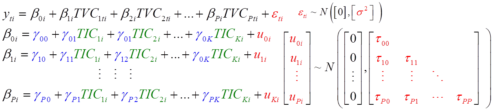
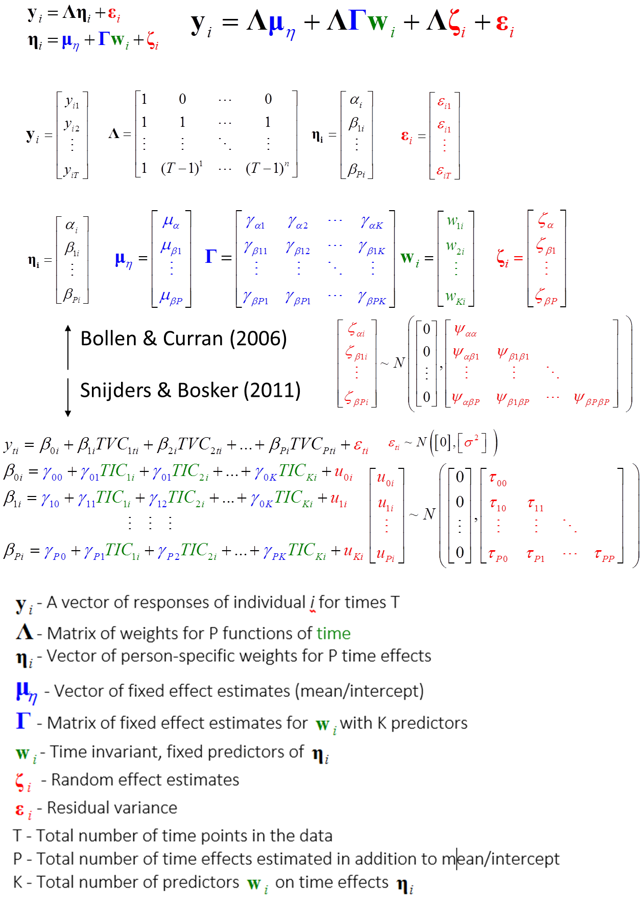

<!--  Set the working directory to the repository's base directory; this assumes the report is nested inside of only one directory.-->
```{r, echo=F, message=F} 
require(knitr)
opts_knit$set(root.dir='../../')  #Don't combine this call with any other chunk -especially one that uses file paths.

```

```{r set_options, echo=F, message=F}
require(knitr)
# getwd()
opts_chunk$set(
  results='show', 
  message = TRUE,
  comment = NA, 
  tidy = FALSE,
  fig.height = 12, 
  fig.width = 14, 
#   out.width = NULL,
  fig.path = 'sequence/',     
  warning = FALSE,
#   ,dev = "png"
   dpi = 70
)
echoChunks <- FALSE
warningChunks<- FALSE
messageChunks<- FALSE
evalChunks <- TRUE
options(width=120) #So the output is 50% wider than the default.
read_chunk("./Reports/LCMsequence/sequence.R") # the file to which knitr calls for the chunks
```

```{r LoadPackages, echo=echoChunks, message=F}
```

```{r LoadSources, echo=echoChunks, message=F}
```

```{r DeclareGlobals, echo=echoChunks, message=FALSE}
```

```{r LoadData, echo=echoChunks, message=T}
# select only respondence in the cross-sectional sample
```

## m0_F 
</img>
$\begin{array}{l}
{y_{ti}} = {\beta _{0i}} + {\varepsilon _{ti}}\\
{\beta _{0i}} = {\gamma _{00}}\\
{}\\
\end{array}$


```{r m0_F, echo=echoChunks, warning=warningChunks, message=messageChunks, eval=evalChunks}
```


## m1_F 
</img>
$\begin{array}{l}
{y_{ti}} = {\beta _{0i}} + {\beta _{1i}}time{c_{ti}} + {\varepsilon _{ti}}\\
{\beta _{0i}} = {\gamma _{00}}\\
{\beta _{1i}} = {\gamma _{10}}
\end{array}$ 


```{r m1_F, echo=echoChunks, warning=warningChunks, message=messageChunks, eval=evalChunks}
```

## m0_R1 
</img>
$\begin{array}{l}
{y_{ti}} = {\beta _{0i}} + {\varepsilon _{ti}}\\
{\beta _{0i}} = {\gamma _{00}} + {u_{0i}}\\
{}\\
\end{array}$ 

```{r m0_R1, echo=echoChunks, warning=warningChunks, message=messageChunks, eval=evalChunks}
```

## m1_R1 
</img>
$\begin{array}{l}
{y_{ti}} = {\beta _{0i}} + {\beta _{1i}}time{c_{ti}} + {\varepsilon _{ti}}\\
{\beta _{0i}} = {\gamma _{00}} + {u_{0i}}\\
{\beta _{1i}} = {\gamma _{10}}
\end{array}$ 


```{r m1_R1, echo=echoChunks, warning=warningChunks, message=messageChunks, eval=evalChunks}
```


## m1_R2 
</img>
$\begin{array}{l}
{y_{ti}} = {\beta _{0i}} + {\beta _{1i}}time{c_{ti}} + {\varepsilon _{ti}}\\
{\beta _{0i}} = {\gamma _{00}} + {u_{0i}}\\
{\beta _{1i}} = {\gamma _{10}} + {u_{1i}}
\end{array}$


```{r m1_R2, echo=echoChunks, warning=warningChunks, message=messageChunks, eval=evalChunks}
```

## General Specification


</img> 
