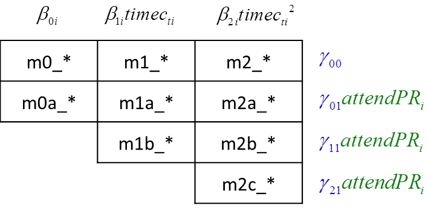

<!--  Set the working directory to the repository's base directory; this assumes the report is nested inside of only one directory.-->
```{r, echo=F, message=F} 
require(knitr)
opts_knit$set(root.dir='../../')  #Don't combine this call with any other chunk -especially one that uses file paths.

```

```{r set_options, echo=F, message=F}
require(knitr)
# getwd()
opts_chunk$set(
  results='show', 
  message = TRUE,
  comment = NA, 
  tidy = FALSE,
  fig.height = 12, 
  fig.width = 14, 
#   out.width = NULL,
  fig.path = 'sequence/',     
  warning = FALSE,
#   ,dev = "png"
   dpi = 70
)
echoChunks <- FALSE
warningChunks<- FALSE
messageChunks<- FALSE
evalChunks <- TRUE
options(width=120) #So the output is 50% wider than the default.
read_chunk("./Reports/LCMsequence/sequence.R") # the file to which knitr calls for the chunks
```

```{r LoadPackages, echo=echoChunks, message=F}
```

```{r LoadSources, echo=echoChunks, message=F}
```

```{r DeclareGlobals, echo=echoChunks, message=FALSE}
```

```{r LoadData, echo=echoChunks, message=T}
# select only respondence in the cross-sectional sample
```


# Overview  
There are total of 29 distinct models, which can be organized into 4 groups:  

+ models with fixed effects only  (F):  9
+ models with      1 random term  (R1): 9
+ models with      2 random terms (R2): 7
+ models with      3 random temrs (R3): 4

The following layout helps understand how each of the model group was constructed. The columns count the number of terms  on the first level, while the rows indicate what predictors are added to the second level. Replace the stars in the name of the model with **F** for models with only the fixed effects  and **R1**, **R2**, and **R3**  for models with the corresponding number of random terms in the second level. 
</img> </br>

For example, all models in group F are as follows.    

</img>  </br>

For maps of R1, R2, and R3 model groups see the bottom of the report. 

# Models with 1 random terms
</img> 

# Models with 1 random terms
</img> 

# Models with 1 random terms
</img> 

# Models with 1 random terms
</img> 


# F-group : fixed effects
## m0_F 
```{r m0_F, echo=echoChunks, warning=warningChunks, message=messageChunks, eval=evalChunks, fig.height= 6} 
```

## m1_F 
```{r m1_F, echo=echoChunks, warning=warningChunks, message=messageChunks, eval=evalChunks, fig.height= 7} 
```

## m2_F 
```{r m2_F, echo=echoChunks, warning=warningChunks, message=messageChunks, eval=evalChunks, fig.height= 8} 
```

## m0a_F 
```{r m0a_F, echo=echoChunks, warning=warningChunks, message=messageChunks, eval=evalChunks, fig.height= 9} 
```


