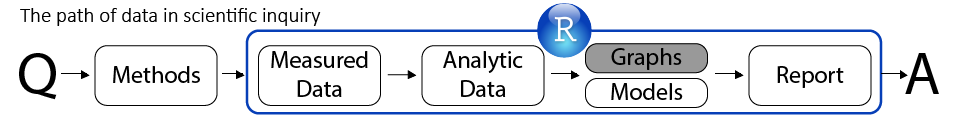
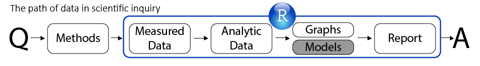
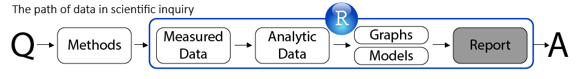

<!--  Set the working directory to the repository's base directory; this assumes the report is nested inside of only one directory.-->
```{r, echo=F, message=F} 
library(knitr)
opts_knit$set(root.dir='../')  #Don't combine this call with any other chunk -especially one that uses file paths.
```

<!-- Set the report-wide options, and point to the external script file. -->
```{r, echo=F, message=T}
require(knitr)
opts_chunk$set(
  results='show', 
  message = TRUE,
  comment = NA, 
  tidy = FALSE,
#   fig.height = 4.8, 
#   fig.width = 6.5, 
  out.width = NULL,
  fig.path = 'figure_rmd/',     
  dev = "png",
  dpi = 70
)
echoChunks <- FALSE
warningChunks<- FALSE
messageChunks<- FALSE
outwidthChunks <- "90%"
options(width=120) #So the output is 50% wider than the default.
read_chunk("./Reports/2014-12-02-Dynamic-Reporting.R") # the file to which knitr calls for the chunks
```

## Information

You can forward your questions to   
Ann Greenwood (ann.greenwood at popdata.bc.ca) or Vincenza Gruppuso (vincenza at uvic.ca).  
Q&A will begin immediately after the presentation.   

You can follow the presentation and review previous lectures at [ialsa.github.io/COAG-colloquium-2014F/](http://ialsa.github.io/COAG-colloquium-2014F/)


## Overview of the Series

- Oct 14  -- Intro to Reproducible Research  
- Oct 21  -- RR Basic Skills (1): Data Manipulation
- Nov  4  -- RR Basic Skills (2): Graph Production  
- Nov 18  -- RR Basic Skills (3): Statistical Modeling     
- Dec 2  -- **RR Basic Skills (4): Dynamic Reporting**     

<div class="notes">
</div>

## Data Origin

</img> 
```p
"./Scripts/Data/dsL.R"
```

download the files to work along at [GitHub](https://github.com/IALSA/COAG-colloquium-2014F)

<div class="notes">
This data flow map shows one possible scenario of data development, relevant to the data at hand. Stage <code>dsW</code>,  <code>dsLong</code>, might be optional, or narrate different transformations. The purpose of such a map is to organize our understanding of the script underlying this map. Thus, when results of the study are reported this map can be used to ease the deconstruction of the script and its further adaptation.
</div>


## Load Data {.smaller}
```{r LoadPackages, echo=F, warning=F, message=F, results='hide'}
```

```{r LoadData, echo=T, warning=F, message=F, results='hide'}
```
```{r}
str(dsL)
```

<div class="notes">
first we load the data set that we have annotated in the previous lectures
</div>


```{r loadTheme, out.width="95%", warning=F, echo=F}
```


## Focal outcome {.smaller}
<div class="columns-2">
```{r dsM00}
```
</br> </br>
How often did you **attend** a worhsip service during the last year?
```{r, echo=F}
attendLevels<- c(1:8)
attendLabels<-c( "Never",
                 "Once or Twice",
                 "Less than once/month",
                 "About once/month",
                 "About twice/month",
                 "About once/week",
                 "Several times/week",
                 "Everyday")
attendMetrics <- data.frame(attendLevels, attendLabels)
dplyr::arrange(attendMetrics,-attendLevels)
```
</div>
</br> </br>


## Producing Graphs
</img> 


## Fitting Statistical Models
</img> 


## Producing Report
</img> 


