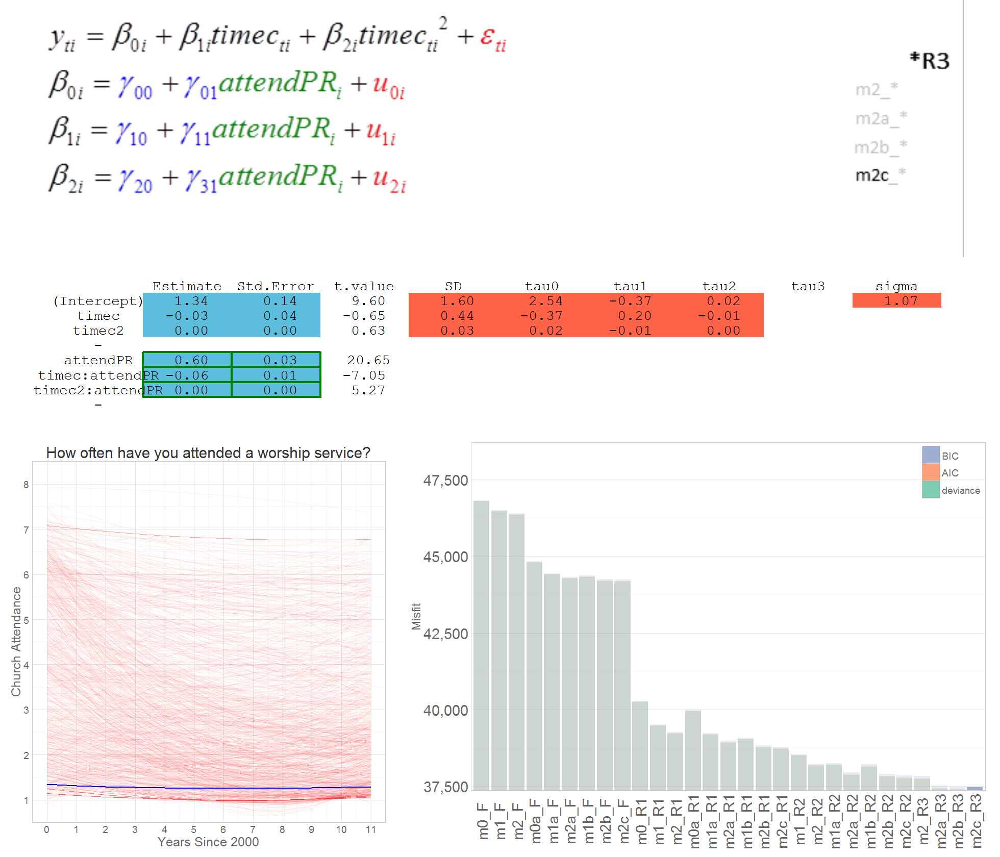

<!--  Set the working directory to the repository's base directory; this assumes the report is nested inside of only one directory.-->
```{r, echo=F, message=F} 
library(knitr)
opts_knit$set(root.dir='../')  #Don't combine this call with any other chunk -especially one that uses file paths.
```

<!-- Set the report-wide options, and point to the external script file. -->
```{r, echo=F, message=T}
require(knitr)
opts_chunk$set(
  results='show', 
  message = TRUE,
  comment = NA, 
  tidy = FALSE,
#   fig.height = 4.8, 
#   fig.width = 6.5, 
  out.width = NULL,
  fig.path = 'figure_rmd/',     
  dev = "png",
  dpi = 70
)
echoChunks <- FALSE
warningChunks<- FALSE
messageChunks<- FALSE
outwidthChunks <- "90%"
options(width=120) #So the output is 50% wider than the default.
read_chunk("./Reports/2014-12-02-Dynamic-Reporting.R") # the file to which knitr calls for the chunks
```


## Final thoughts : Two  concepts  

### Model Manifestation  
</br>

### Model Sequence  
</br>

<div class="columns-2">
</img> 


</div>

## Final thoughts : Three ideas 

###  report = software  
</br>

###  model competition + model collaboration  
</br>

### science = art = design = technology


