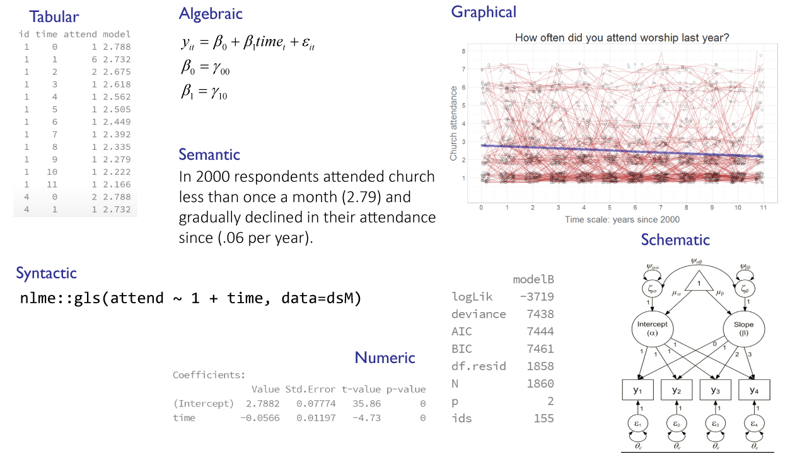

<!--  Set the working directory to the repository's base directory; this assumes the report is nested inside of only one directory.-->
```{r, echo=F, message=F} 
library(knitr)
opts_knit$set(root.dir='../')  #Don't combine this call with any other chunk -especially one that uses file paths.
```

<!-- Set the report-wide options, and point to the external script file. -->
```{r, echo=F, message=T}
require(knitr)
opts_chunk$set(
  results='show', 
  message = TRUE,
  comment = NA, 
  tidy = FALSE,
#   fig.height = 4.8, 
#   fig.width = 6.5, 
  out.width = NULL,
  fig.path = 'figure_rmd_try/',     
  dev = "png",
  dpi = 70
)
echoChunks <- FALSE
warningChunks<- FALSE
messageChunks<- FALSE
outwidthChunks <- "90%"
options(width=120) #So the output is 50% wider than the default.
read_chunk("./Reports/2014-12-02-Dynamic-Reporting.R") # the file to which knitr calls for the chunks
```

## Load Data {.smaller}
```{r LoadPackages, echo=F, warning=F, message=F, results='hide'}
```

```{r LoadData, echo=T, warning=F, message=F, results='hide'}
```

```{r loadTheme, out.width="95%", warning=F, echo=FALSE, results='hide'}
```

<!--
Photoshop image settings:
Use the following dimensions:
For slides WITH title and image at 100% 
1280 x 900  -  wide: cuts off         tall: bottom bleeds
1280 x 720  -  wide: bottom bleeds    tall: bottom 4 lines  SELECTED
1280 x 680  -  wide: bottom 1 line    tall: bottom 5 lines
1280 x 650  -  wide: bottom 2 lines   tall: bottom 6 lines
-->


## ...
## Model manifestations {.smaller}
</img> 

## Today

<div class="red">**STRATEGIC GOAL** </div> 
- Evaluate a series of models

<div class="red">**TACTICAL GOAL**</div>  
 - Design a dynamic document for model sequencing 

<div class="red">**TECHNICAL ASSIGNMENT**</div>
 1. choose/specify what models should constitute the sequence  
 2. estimate each model  
 3. extract and organize solutions  
 4. choose/create model manifestations (MM)  
 5. combine MMs into a report on each model  
 6. combine model reports into sequence report  
 7. customize navigation through the sequence  


## Scripts involved

**model-SPECIFY.R** - contains model specifications of models as gls/lmer syntax.  
</br>
**model-ESTIMATE.R** - contains the loop that cycles through all available model specifications. Includes the following operations: </br>     
1. Derives the dataset to be used  
2. Estimates models:     
  - lme4::lmer - *if a model contains     random effects*  
  - nlme::gls - *if a model contains only fixed effects*    
3. Post-process model solution and save datasets:  
  - <code>dsmInfo.rds</code> - *model fit and information indices*   
  - <code>dsFERE.rds</code>  - *fixed (FE) and random effects (RE) descriptors*    
  - <code>dsp.rds</code> - *predicted values from the model*     
</br>
**model-COLLECT-SOLUTIONS.R** - combines datasets containing model solutions  


## Scripts involved

**graph-FERE.R** - creates a tile graph of model solution   
</br>
**graph-PREDICT.R** - creates a line graph of predicted trajectories   
</br>
**graph-FIT** - creates a  bar graph of model performance indices
</br>

<div class="red">** sequence.R(md)**</div> - produces sequence reports


