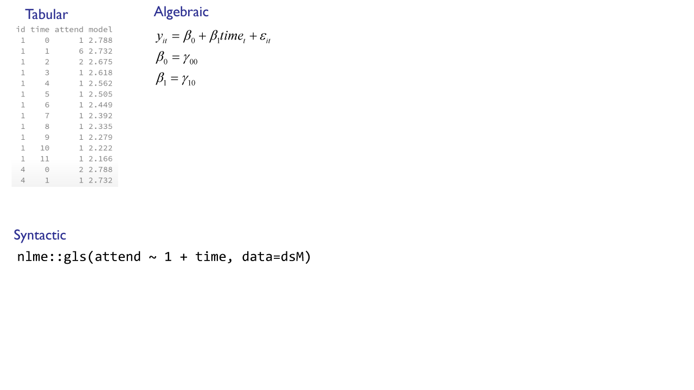
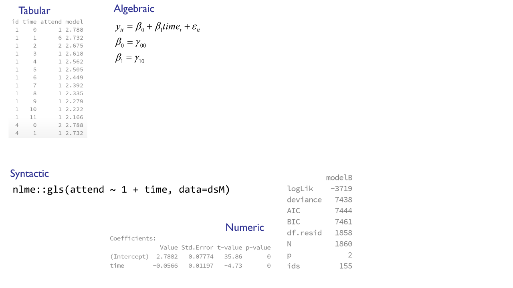

<!--  Set the working directory to the repository's base directory; this assumes the report is nested inside of only one directory.-->
```{r, echo=F, message=F} 
library(knitr)
opts_knit$set(root.dir='../')  #Don't combine this call with any other chunk -especially one that uses file paths.
```

<!-- Set the report-wide options, and point to the external script file. -->
```{r, echo=F, message=T}
require(knitr)
opts_chunk$set(
  results='show', 
  message = TRUE,
  comment = NA, 
  tidy = FALSE,
#   fig.height = 4.8, 
#   fig.width = 6.5, 
  out.width = NULL,
  fig.path = 'figure_rmd_try/',     
  dev = "png",
  dpi = 70
)
echoChunks <- FALSE
warningChunks<- FALSE
messageChunks<- FALSE
outwidthChunks <- "90%"
options(width=120) #So the output is 50% wider than the default.
read_chunk("./Reports/2014-11-18-Statistical-Modeling.R") # the file to which knitr calls for the chunks
```

## Load Data {.smaller}
```{r LoadPackages, echo=F, warning=F, message=F, results='hide'}
```

```{r LoadData, echo=T, warning=F, message=F, results='hide'}
```

```{r loadTheme, out.width="95%", warning=F, echo=FALSE, results='hide'}
```

```{r dsM01, echo=FALSE, results='hide'}
```

<!--
Photoshop image settings:
Use the following dimensions:
For slides WITH title and image at 100% 
1280 x 900  -  wide: cuts off         tall: bottom bleeds
1280 x 720  -  wide: bottom bleeds    tall: bottom 4 lines  SELECTED
1280 x 680  -  wide: bottom 1 line    tall: bottom 5 lines
1280 x 650  -  wide: bottom 2 lines   tall: bottom 6 lines
-->


## ...


## Modeling: manifestations {.smaller}
  1. Tabular  
  2. Algebraic  
  3. Syntactic  
  4. Numeric  
  5. Graphical
  6. Schematic  
  7. Semantic  
  
  
Press (P): Zoom  
Next: 

## test {.smaller}
</img>  
Press (P): Zoom  
Next:


## Modeling: manifestations {.smaller}
  1. Tabular  
  2. Algebraic  
  3. Syntactic  
  4. Numeric  
  5. Graphical
  6. Schematic  
  7. Semantic  
  
## Model manifestations {.smaller}
  
  
```{r}
dsM <- dplyr::filter(dsL, id <= 300) %>% 
  dplyr::filter(ave((!is.na(attend)), id, FUN = all)) %>%
  dplyr::mutate(time=year-2000) %>%
  dplyr::select(id, time, attend)
model <- nlme::gls(attend ~ 1 + time, data=dsM)
dsM$model <- predict(model)
dplyr::filter(dsM,row_number()<15)
```

## Model manifestations {.smaller}
</img>  

## Model manifestations {.smaller}
</img>  

## Model manifestations {.smaller}
</img>  


## Model manifestations {.smaller}
</img>  


## Model manifestations {.smaller}
</img>  


## Model manifestations {.smaller}
</img>  


## Model manifestations {.smaller}
</img>  


