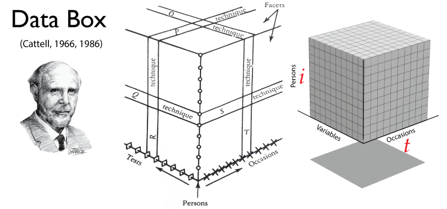

<!--  Set the working directory to the repository's base directory; this assumes the report is nested inside of only one directory.-->
```{r, echo=F, message=F} 
library(knitr)
opts_knit$set(root.dir='../')  #Don't combine this call with any other chunk -especially one that uses file paths.
```

<!-- Set the report-wide options, and point to the external script file. -->
```{r, echo=F, message=T}
require(knitr)
opts_chunk$set(
  results='show', 
  message = TRUE,
  comment = NA, 
  tidy = FALSE,
#   fig.height = 4.8, 
#   fig.width = 6.5, 
  out.width = NULL,
  fig.path = 'figure_rmd/',     
  dev = "png",
  dpi = 70
)
echoChunks <- FALSE
warningChunks<- FALSE
messageChunks<- FALSE
outwidthChunks <- "90%"
options(width=120) #So the output is 50% wider than the default.
read_chunk("./Reports/2014-11-18-Statistical-Modeling.R") # the file to which knitr calls for the chunks
```


## What is Statistical Modeling? {.smaller}
<div class="columns-2">
### What is a model?
 - simplifications of a complex reality   
 - "mechanism" for reproducing data
 - operationalization of substantive theory
 
### What does modeling involve?   
 - generating data points  
 - comparing observed and modeled data
 - describing properties and attribues of a model
 - comparing and contrasting models  

##### (Rodgers, 2010)
</br></br>  

#### Theoretical model of change  
  - Shape  of change
  - Scale  of change
  - Periodicity 

#### Temporal design  
 - Timing  
 - Frequency  
 - Spacing  

### Statistical model of change  
 - Operationalization of theoretical model of change  
 
##### (Collins, 2006) 
 
 
</div>
<div class="notes">
[Rodgers, 2010](http://psych.colorado.edu/~willcutt/pdfs/Rodgers_2010.pdf):  Rodgers, J. L. (2010). The epistemology of mathematical and statistical modeling: a quiet methodological revolution. American Psychologist, 65(1), 1.   
</br>
[Collins, 2006](http://www2.sep.ucr.ac.cr/GESTION/CursoUGES2010/416ec3a16c697369735f64655f6461746f735f6c6f6e6769747564696e616c735f496e74656772616369c3b26e5f64655f6d6f64656c6f735f7465c3b37269636f735f6461746f735f795f6d6f64656c6f735f6573746164c3ad737469636f73.pdf):Collins, L. M. (2006). Analysis of longitudinal data: The integration of theoretical model, temporal design, and statistical model. Annu. Rev. Psychol., 57, 505-528.
</div>
Press (P): Citation   
Next: Example of a modeling project


## Example of data workflow map:

</img> 
```p
"./Scripts/Data/dsL.R"
```

Full example is at [COAG](http://www.coag.uvic.ca/)'s [lecture series](https://ialsa.github.io/COAG-colloquium-2014F) on reproducible research.

<div class="notes">
Last time we talked about the flow of data in a research project. The data flow map shows one possible scenario of data development, relevant to the data at hand. Stage <code>dsW</code>,  <code>dsLong</code>, might be optional, or narrate different transformations. The purpose of such a map is to organize our understanding of the script underlying this map. Thus, when results of the study are reported this map can be used to ease the deconstruction of the script and its further adaptation.
</div>


## Study in Focus

### NLSY97
  - [National Longitudinal Study of Youth 1997](https://nlsinfo.org/cohorts/nlsy97)
  - Household sample
  - ~ 9,000 respondents
  - 5 cohorts
  - ages from 13 to 31
  - started in 1997 
  - continues today
  - <div class="red2">outcome: church attendance</div>


## Load Data {.smaller}
```{r LoadPackages, echo=F, warning=F, message=F, results='hide'}
```

```{r LoadData, echo=T, warning=F, message=F, results='hide'}
```
```{r}
str(dsL)
```

<div class="notes">
first we load the data set that we have annotated in the previous lectures
</div>


```{r loadTheme, out.width="95%", warning=F, echo=F}
```

## Focal outcome {.smaller}
<div class="columns-2">

```{r dsM00}
```
</br> </br>
How often did you **attend** a worhsip service during the last year?
```{r, echo=F}
attendLevels<- c(1:8)
attendLabels<-c( "Never",
                 "Once or Twice",
                 "Less than once/month",
                 "About once/month",
                 "About twice/month",
                 "About once/week",
                 "Several times/week",
                 "Everyday")
attendMetrics <- data.frame(attendLevels, attendLabels)
dplyr::arrange(attendMetrics,-attendLevels)
```
</div>
</br> </br>


## Map data to graphics {.smaller}
<div class="columns-2">
```{r dsM00}
```
</br>
```{r graphBasic, out.width="95%", warning=F, echo=F}
```
</div>
Press (P): Note | Next: more complex graph 

<div class="notes">
We start with a very simply graph like this
```{r graphBasic, out.width="100%", warning=F, echo=F}
```
</div>

## Graph development {.smaller}
<div class="columns-2">
```{r graphFullPrevious, out.width="95%", warning=F}
```
</div>
<div class="notes">
Layer by layer we deloped the simple graph into a more complex visualization.
```{r graphFullPrevious, out.width="100%", echo=F,warning=F,message=F}
```
</div>
Press (P): Zoom | Prelude to modeling   


## Prelude to modeling {.smaller}
<div class="columns-2">
```{r dsM01}
```

```{r graph01, out.width="95%", warning=F, echo=F}
```
Representation of information:  
  - tabular   
  - graphical   
  - 
</div>


## Prelude to modeling {.smaller}
<div class="columns-2">
```{r dsM01}
```

```{r graph01, out.width="95%", warning=F, echo=F}
```
Representation of information:  
  - tabular   
  - graphical   
  - algebraic $${y_{1t}}$$
</div>
<div class="notes">
Two subscripts ${_i}$ and ${_t}$ represent  person and occasion dimensions respectively.
</br> </br>
</img>  
</div>
Press (P): notation, databox | 
Next: different person
