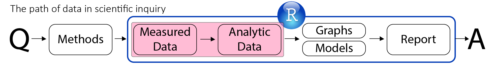

<!--  Set the working directory to the repository's base directory; this assumes the report is nested inside of only one directory.-->
```{r, echo=F, message=F} 
library(knitr)
opts_knit$set(root.dir='../')  #Don't combine this call with any other chunk -especially one that uses file paths.
```

<!-- Set the report-wide options, and point to the external script file. -->
```{r, echo=F, message=T}
require(knitr)
opts_chunk$set(
  results='show', 
  message = TRUE,
  comment = NA, 
  tidy = FALSE,
#   fig.height = 4.8, 
#   fig.width = 6.5, 
  out.width = NULL,
  fig.path = 'figure_rmd_try/',     
  dev = "png",
  dpi = 400
)
echoChunks <- FALSE
warningChunks<- FALSE
messageChunks<- FALSE
options(width=120) #So the output is 50% wider than the default.
read_chunk("./Scripts/Data/dsL.R") # the file to which knitr calls for the chunks
```


##Slide 1
```{r LoadPackages, message=F,warning=F}
```


----

</img>  


----


- Reproducible  

---- 


### Goals of RR  
- *Ultimate* : Answering a research **question**    
- *Practical* : Publishing a **manuscript**   
- *Technical* : Producing a **dynamic document**   

---- 



## TODAY

---- 


### Making "messy" data "tidy"
1. Each variable forms a column
2. Each observation forms a row
3. Each type of observational unit forms a table

See [Hadley Wickham's](http://had.co.nz/) paper on [tidy data](http://www.jstatsoft.org/v59/i10/paper)
